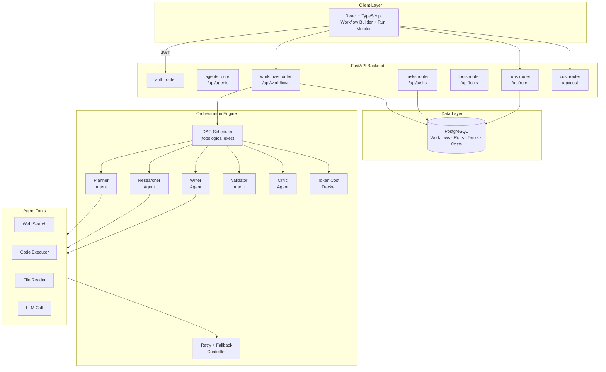

# Orion

**Multi-Agent Workflow Orchestration Platform**

[**🔗 View Live Preview →**](https://www.perplexity.ai/computer/a/orion-preview-project-1-of-9-lCA5DWRgQoa4AN6VYPXAUQ)

> A production-style multi-agent workflow orchestration platform where specialized AI agents are composed into task pipelines, each with defined roles, tool access, retry logic, and cost tracking — built to reflect how real LLM-powered automation systems are structured.

---

## 🎯 What I Built & Why

Single-agent LLM systems break down on complex tasks. I built Orion to practice the core patterns of multi-agent orchestration: how you decompose work, route between agents, handle failures gracefully, and keep costs observable.

- **Role-specialized agents** — each agent has a defined capability contract (planner, researcher, writer, validator, critic) with scoped tool access, preventing agents from overreaching their role
- **Directed task graph execution** — workflows are defined as DAGs; the orchestrator resolves dependencies and executes agents in topological order with parallel branches where possible
- **Retry + fallback logic** — per-agent retry policies with exponential backoff, fallback agent routing, and graceful degradation so one tool failure doesn’t cascade
- **Token cost tracking** — every agent invocation logs prompt + completion tokens; `GET /api/workflows/{id}/cost` returns a per-agent, per-run cost breakdown

---

## 🏗️ Architecture



---

## 📷 Features

- **Role-specialized agents** — Planner, Researcher, Writer, Validator, Critic with scoped tool access
- **DAG workflow execution** — dependency-resolved topological scheduling with parallel branches
- **Retry + fallback logic** — per-agent exponential backoff and graceful degradation
- **Token cost tracking** — per-agent, per-run cost breakdown with budget alerts
- **Workflow builder UI** — visual agent graph construction and real-time run monitoring
- **Run history & replay** — full execution traces with per-step logs and outputs
- **Docker Compose** — one-command local stack

---

## 🛠️ Tech Stack

| Layer | Technology |
|---|---|
| Backend API | FastAPI + SQLAlchemy + PostgreSQL |
| Agent Orchestration | Custom DAG executor + LLM tool calling |
| Frontend | React + Vite + TypeScript |
| Infra | Docker Compose + GitHub Actions CI |

---

## 🚀 Quick Start

```bash
docker compose up --build
# Backend API docs: http://localhost:8000/docs
# Frontend:         http://localhost:5173
```

### Local Development
```bash
cd backend && pip install -e .[dev]
cp .env.example .env   # add your LLM API key
uvicorn app.main:app --reload

cd frontend && npm ci && npm run dev
```

### Run a sample workflow from the CLI

```bash
python scripts/run_sample_workflow.py \
  --goal "Search the vendor landscape. Then compare three options. Summarize findings."
```

This boots an in-process API against an ephemeral SQLite DB, submits the task,
polls until the run reaches a terminal state, and prints the timeline of agent
decisions. Five demo scenarios (research, triage, reporting, retry/fallback,
human-in-the-loop) live in [`data/sample_tasks.json`](data/sample_tasks.json).

### Quality Checks
```bash
make lint && make test
```

---

## 🖼️ Screenshots

Placeholder captures live in [`docs/screenshots/`](docs/screenshots/) — replace
with real shots of the dashboard, workflow graph, execution log, and approval
queue once captured from a local run.

---

## 🗂️ Repository Structure

```
backend/    FastAPI API, DAG orchestrator, agent roles, tool registry, cost tracker, tests
frontend/   React workflow builder and run monitor
docs/       Architecture, API surface, resume bullets, screenshot placeholders
data/       Sample task scenarios used by the demo CLI
scripts/    CLI entry points (e.g. run_sample_workflow.py)
```

---

## 📝 Key Learnings

- Role specialization is the most important architectural decision in multi-agent systems — general-purpose agents drift; scoped agents stay predictable
- Cost tracking is a first-class production concern, not an afterthought; token costs compound quickly across nested agent calls
- Retry + fallback logic at the agent level (not just the API level) is what separates a demo from a reliable system

---

## 📌 Limitations & Future Work

- Tool implementations are deterministic stubs (echo, math, mocked HTTP) so the
  orchestrator can be tested without external API keys; swapping in real LLM
  and web-search backends is a planned next step.
- This is a portfolio project, not a production-deployed service. No real users,
  no SLA, no live tenants.
- Postgres is supported via SQLAlchemy and `docker-compose.yml`; tests run on
  SQLite for speed.

## 📝 Resume Bullets

See [`docs/resume-bullets.md`](docs/resume-bullets.md) for ATS-friendly,
one-line bullets covering AI agents, multi-agent systems, workflow
orchestration, automation, APIs, state management, and task routing.

## 📄 License

MIT
