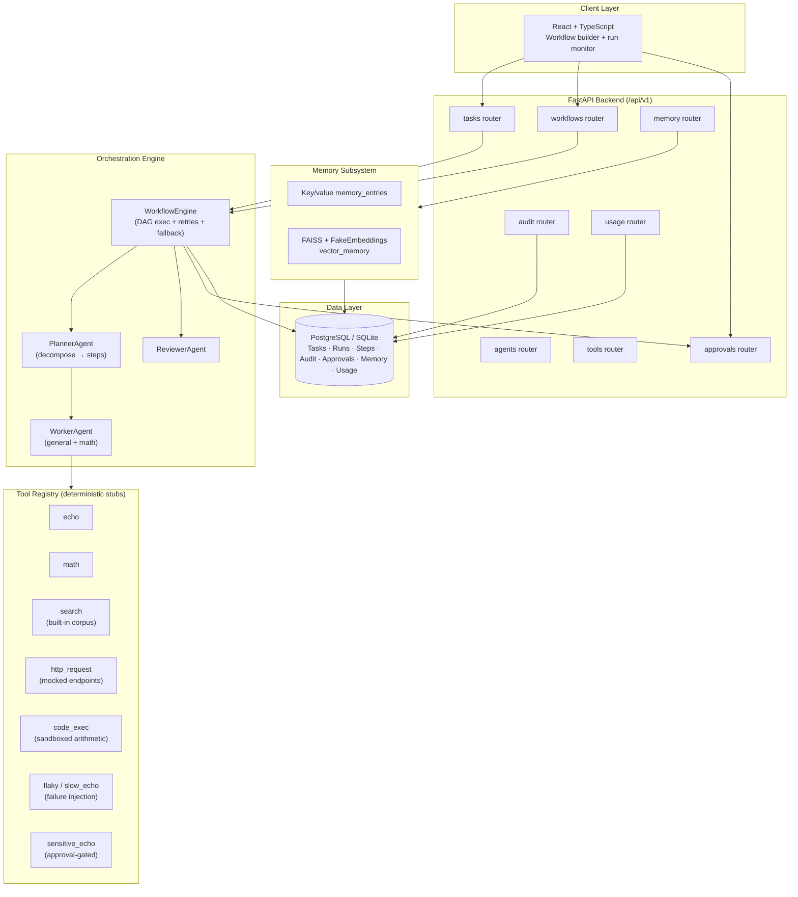

# Orion — Multi-Agent Workflow Orchestration Platform

**Multi-Agent Workflow Orchestration Platform — Portfolio Project**

[**🎨 UI / Portfolio Design Preview →**](https://www.perplexity.ai/computer/a/orion-preview-project-1-of-9-lCA5DWRgQoa4AN6VYPXAUQ)

> A portfolio-grade reference implementation of multi-agent workflow orchestration: a planner decomposes a goal into a typed DAG, role-specialized worker and reviewer agents execute steps through a tool registry, and the system tracks retries, fallbacks, approvals, and run metrics. **Tool execution is intentionally deterministic** (no live LLM or external API calls) so the orchestration patterns can be exercised end-to-end without API keys.

---

## 🎬 Recruiter Demo in 2 Minutes

```bash
# 1. Clone and install (one time)
git clone https://github.com/RyanJBush/Multi-agent-workflow-orchestration-platform.git
cd Multi-agent-workflow-orchestration-platform
make install

# 2. Run a multi-step workflow end-to-end from the CLI
python scripts/run_sample_workflow.py \
  --goal "Search the vendor landscape. Then compare three options. Summarize findings."
```

The script boots the FastAPI app in-process against an ephemeral SQLite DB,
submits a goal, polls the run, and prints the full agent timeline.
Five scenarios — research, triage, reporting, retry/fallback, and
human-in-the-loop — are defined in [`data/sample_tasks.json`](data/sample_tasks.json).
See [`docs/demo-runbook.md`](docs/demo-runbook.md) for a guided walkthrough.

---

## 📋 Project Snapshot

| | |
|---|---|
| **Type** | Portfolio / reference implementation (not a production service) |
| **Backend** | Python 3.11+, FastAPI, SQLAlchemy 2.x, Pydantic |
| **Frontend** | React 18, TypeScript, Vite, React Router |
| **Datastore** | PostgreSQL (Docker Compose); SQLite for tests + demo CLI |
| **Tests** | 129 pytest tests across API, services, planner, retries, approvals, memory |
| **CI** | GitHub Actions: ruff lint, mypy (advisory), pytest, frontend lint + build |
| **Tool execution** | Deterministic in-process stubs (echo, math, search corpus, mocked HTTP, sandboxed arithmetic). **No live LLM or external API calls.** |
| **LLM integration** | None active. `langchain-community.FakeEmbeddings` + FAISS used for the memory subsystem. Swapping in a real LLM is a planned next step. |
| **Auth** | JWT-based dependency available; demo CLI uses a static secret |

---

## 🧭 What This Project Demonstrates

This repo is a focused study of the *control-plane* patterns behind multi-agent
systems, deliberately decoupled from any specific LLM provider:

- **DAG scheduling** — the planner emits an ordered step list with
  `dependencies`, and `WorkflowEngine` executes dependency-ready work,
  persisting status transitions (`pending → running → completed/failed/blocked`)
  for each step.
- **Role-specialized agents** — `PlannerAgent`, `WorkerAgent`
  (general + math variants), and `ReviewerAgent` each return a structured
  `AgentResponse` with a `ReasoningTrace` (summary, confidence, tags),
  giving every step an auditable decision record.
- **Retry + fallback logic** — each planned step carries a `RetryPolicy`
  (`max_retries`, `backoff_seconds`) and an optional `fallback_action` with
  `fallback_on_errors` triggers; the engine consumes both at execution time.
- **Tool registry pattern** — tools implement a common `Tool` interface,
  register a name, and are invoked by the worker through a single registry
  with optional timeout overrides — adding a new tool requires no orchestrator
  change.
- **Human-in-the-loop approvals** — steps flagged as sensitive transition
  the run into `blocked` until an `approvals` API decision is recorded.
- **Run observability** — per-run metrics (`/workflows/runs/{id}/metrics`)
  expose `total_steps`, `completed_steps`, `failed_steps`, `retried_steps`,
  `fallback_steps`, and `avg_step_latency_ms`; platform-level metrics
  (`/workflows/metrics`) add completion rate, retry rate, and tool reliability.
- **State machine over SQLAlchemy** — runs, steps, audit events, memory
  entries, approvals, and usage quotas are all first-class persisted models
  with explicit state transitions.

> **What it does *not* demonstrate yet:** token-level cost accounting against a
> real LLM, distributed execution across workers, and live tool integrations
> (search APIs, headless browsers, code sandboxes). See
> [Limitations & Future Work](#-limitations--future-work).

---

## 🏗️ Architecture



Full breakdown: [`docs/architecture.md`](docs/architecture.md).

---

## 🔑 Key Technical Highlights

- **Typed agent contract** (`backend/app/agents/contracts.py`) — every agent
  returns `AgentResponse` with `output`, `status`, and a `ReasoningTrace`,
  so every step in a run produces a uniform, inspectable record.
- **Planner produces an explicit DAG** — `PlannerAgent.decompose` returns
  `PlannedStep` records with `dependencies`, `retry_policy`, `fallback_action`,
  and `fallback_on_errors`. The DAG is data, not control flow.
- **Two retry surfaces** — the tool registry enforces per-tool timeouts,
  and the engine applies the planned step's `RetryPolicy` (exponential
  backoff) on top, with a fallback action for `timeout` or `runtime` errors.
- **Approval gate as a state transition** — steps tagged "sensitive" move
  the run to `blocked`; an explicit approval decision via `/approvals` is
  required before execution resumes (see `test_approvals.py`).
- **Workflow templates + replay** — workflows can be saved as templates,
  re-run, paused/resumed/cancelled, and replayed; the run timeline endpoint
  reconstructs the ordered event log.
- **Workflow insights endpoint** — `/workflows/runs/{id}/insights` returns
  a generated plan explanation, reflection, and suggested next actions
  derived from the persisted run state.
- **Memory subsystem** — basic key/value writes plus a FAISS-backed vector
  store using `FakeEmbeddings` so the search path works without any embedding
  API keys.
- **Test coverage focused on behavior** — 129 tests cover planner branching,
  retry exhaustion, fallback selection, approval flow, audit logging, memory
  search, and end-to-end run lifecycle.

---

## 📷 Screenshots / Demo

Real captures live in [`docs/screenshots/`](docs/screenshots/). The folder
currently holds placeholder filenames and capture instructions — replace each
with a real PNG from a local run before sharing externally.

Suggested captures (in order of recruiter impact):

1. **Workflow builder** — the workflow construction surface in the React app.
2. **DAG view** — `WorkflowGraph.tsx` showing dependency edges between steps.
3. **Run logs / execution trace** — `ExecutionLogPanel.tsx` with per-agent
   reasoning traces, retries, and fallback markers.
4. **Run metrics** — KPI cards on `DashboardPage.tsx` showing completion rate,
   retry rate, and latency.
5. **Approval queue** — a sensitive step blocked on a reviewer decision.
6. **FastAPI auto-docs** — `/docs` showing the typed OpenAPI surface.

> **Note on cost tracking.** Token/$ accounting is not implemented yet because
> tool calls are deterministic stubs, not LLM calls. The dashboard surfaces
> run-level metrics (retries, latency, completion) rather than token cost.

---

## 🛠️ Tech Stack

| Layer | Technology |
|---|---|
| Backend API | FastAPI + SQLAlchemy 2.x + Pydantic |
| Orchestration | Custom planner + DAG engine + tool registry (all in-process) |
| Memory | langchain-community FAISS vector store + FakeEmbeddings |
| Frontend | React 18 + TypeScript + Vite + React Router |
| Datastore | PostgreSQL (Docker); SQLite for tests/demo |
| Infra | Docker Compose, Makefile, GitHub Actions CI |

---

## 🚀 How to Run Locally

### Option A — Docker Compose (full stack)
```bash
docker compose up --build
# Backend API docs: http://localhost:8000/docs
# Frontend:         http://localhost:5173
```

### Option B — Native dev loop
```bash
# Backend
cd backend && pip install -e .[dev]
ORION_JWT_SECRET=dev-secret uvicorn app.main:app --reload --port 8000

# Frontend (separate shell)
cd frontend && npm ci && npm run dev
```

### Option C — One-shot CLI demo (no Docker, no frontend)
```bash
python scripts/run_sample_workflow.py \
  --goal "Search the vendor landscape. Then compare three options. Summarize findings."
```

### Quality checks
```bash
make lint   # ruff + eslint
make test   # pytest (129 tests)
```

See [`docs/demo-runbook.md`](docs/demo-runbook.md) for a guided walkthrough,
[`docs/architecture.md`](docs/architecture.md) for the design, and
[`docs/api.md`](docs/api.md) for the API surface.

---

## 📌 Limitations & Future Work

| Area | Current state | Future direction |
|---|---|---|
| **Tool execution** | Deterministic in-process stubs (echo, math, mocked HTTP, search corpus, sandboxed arithmetic) | Wire `search` to a real search API; replace `http_request` with httpx + allowlisted egress; add a real code sandbox |
| **LLM integration** | None active; planner uses keyword routing, memory uses `FakeEmbeddings` | Swap planner to a real LLM call (Anthropic / OpenAI); replace `FakeEmbeddings` with a hosted embedding model |
| **Token / cost tracking** | Not implemented. Only `usage/quota` (actor-level quotas) and run-level latency/retry metrics are tracked | Add per-step token + cost accounting once a real LLM is wired in; expose a `/cost` endpoint |
| **Execution model** | Synchronous, single-process; all step state goes through the in-memory engine + DB | Move to a background worker / queue (Celery, Arq, or Temporal) for long-running steps |
| **Deployment** | Local docker-compose only; no live hosting | Stand up a hosted demo; add observability (OpenTelemetry traces) |
| **Auth** | JWT plumbing exists; demo runs with a static secret | Full user model + role-based authorization |
| **Frontend** | Functional but minimal; routes for dashboard, tasks, workflow exec, agent monitor, settings, demo | Visual DAG editor, richer run timeline, real-time updates via SSE/WebSocket |

This is a **portfolio project**, not a production-deployed service. No real
users, no SLA, no live tenants.

---

## 📝 Resume Bullets

Five to eight ATS-friendly, single-line bullets are maintained in
[`docs/resume-bullets.md`](docs/resume-bullets.md), covering AI agents,
multi-agent systems, workflow orchestration, automation, APIs, state
management, and task routing.

---

## 🗂️ Repository Structure

```
backend/    FastAPI API, DAG orchestrator, agent roles, tool registry, memory, 129 tests
frontend/   React + TypeScript workflow builder and run monitor
docs/       Architecture, API surface, demo runbook, resume bullets, screenshot guide
data/       Five sample task scenarios used by the demo CLI
scripts/    CLI entry points (e.g. run_sample_workflow.py)
.github/    CI workflow + issue/PR templates
```

---

## 🏷️ Project Status

- **Stage:** Active portfolio project — code, tests, and CI are green;
  documentation pass complete.
- **Maintenance:** Personal; not accepting feature contributions, but bug
  reports and recruiter questions are welcome via issues.
- **Last verified:** All claims in this README are grounded in the source
  tree as of the most recent commit on `main`. If a claim doesn't match the
  code, please open an issue — accuracy is treated as a release blocker.

---

## 📄 License

MIT — see [`LICENSE`](LICENSE).
